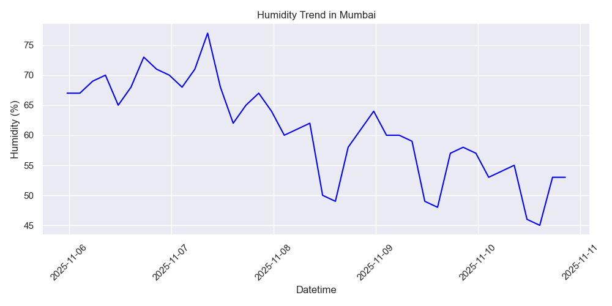
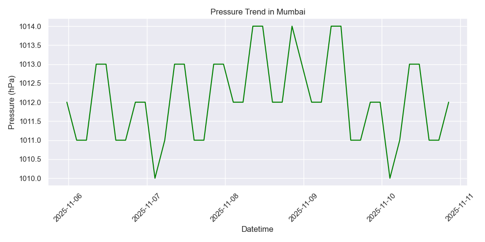

## Task1_APIVisualization
Internship Task 1: API Integration and Data Visualization using Python

COMPANY : CODTECH IT SOLUTIONS

NAME : LAKKADASU SAILAXMIGANESH

INTERN ID : CT12DY1707

DOMAIN : PYTHON

DURATION : 12 WEEKS

 # Project Overview

It integrates real-time weather data from the **OpenWeatherMap API** and visualizes key weather parameters such as **Temperature**, **Humidity**, and **Pressure** using Python libraries.

The goal is to demonstrate:

* API data fetching using Python (`requests` module)
* Data processing with `pandas`
* Data visualization using `matplotlib` and `seaborn`

---

## Technologies & Tools Used

* **Programming Language:** Python
* **Libraries:**

  * `requests` – to fetch data from API
  * `pandas` – for data handling
  * `matplotlib` & `seaborn` – for visualization
* **API Used:** [OpenWeatherMap API](https://openweathermap.org/api)
* **IDE:** Visual Studio Code
* **Version Control:** Git & GitHub

---

###  Output

#### Temperature Trend

#### Humidity Trend

#### Pressure Trend

